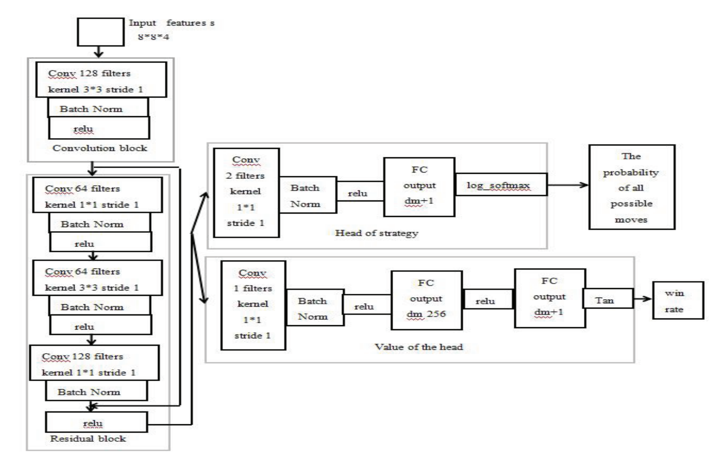

## 算法

### 调研

[MCTS Tic-Tac-Toe Visualization (vgarciasc.github.io)](https://vgarciasc.github.io/mcts-viz/)

可视化蒙特卡洛算法

不难发现需要反复地进行模拟与胜负判断，需要一个高速的胜负判断函数

[Evolving Gomoku Solver by Genetic Algorithm:](https://ieeexplore.ieee.org/stamp/stamp.jsp?tp=&arnumber=6976460)

2014年

基本想法：限制可行解范围为当前所有棋子的外边界再往外延伸一格，DNA为未来双方7步，最大化每一步的eval

实验结果：只是说能打败人，复杂度基本不变

[Applied Sciences | Free Full-Text | Enhanced Reinforcement Learning Method Combining One-Hot Encoding-Based Vectors for CNN-Based Alternative High-Level Decisions | HTML (mdpi.com)](https://www.mdpi.com/2076-3417/11/3/1291/htm)

2021年

Gobang Game Algorithm Based on Reinforcement Learning

[Gobang Game Algorithm Based on Reinforcement Learning](https://ieeexplore.ieee.org/stamp/stamp.jsp?tp=&arnumber=9277188)

2020年

基本想法：强化学习+蒙特卡洛（生成数据

该神经网络底层共用，能够进行估值与下棋判断

实验结果：在8*8的棋盘上与人打黑先手73%胜率，感觉并不是特别好

[alphazero_preprint.pdf (ucl.ac.uk)](https://discovery.ucl.ac.uk/id/eprint/10069050/1/alphazero_preprint.pdf)

alphazero，作为chess game的general ai

有用的点：贝叶斯优化（调参）

alpha go

想法：通过深度神经网络进行P(下一次的action)与V(当前局面评估值)，数据集通过蒙特卡洛树进行生成

